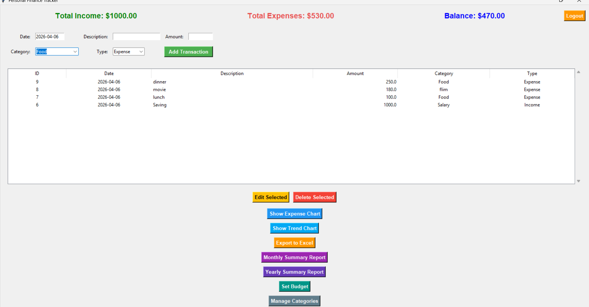
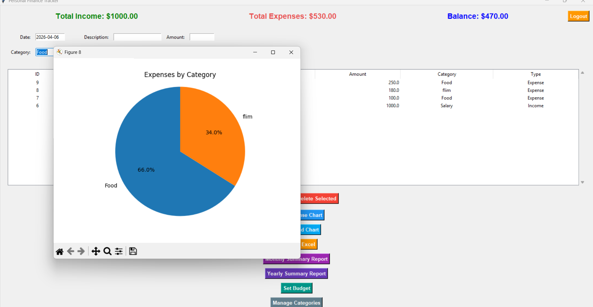
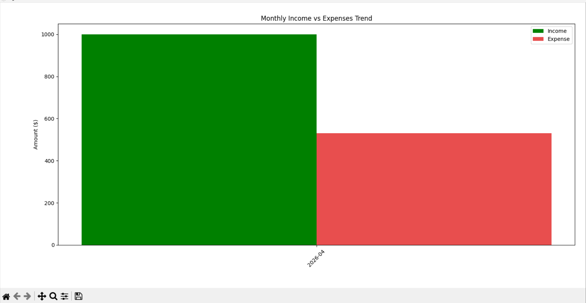

# Personal Finance Tracker

A Personal Finance Tracker built using Python, SQLite, and Matplotlib to help users manage income, expenses, and visualize financial data easily.

## Features

- Add income records
- Add expense records
- Store financial data using SQLite database
- View financial summaries
- Visualize spending patterns using charts (Matplotlib)
- Set monthly category budgets
- Budget exceeded warning alerts
- Export financial data to Excel
- Monthly summary report
- Yearly summary report
- Manage expense categories
## Technologies Used

- Python
- SQLite
- Matplotlib

## Project Structure

main.py – Main program file  
finance_db.py – Database handling logic  
finance.db – SQLite database  

## How to Run the Project

1. Install Python
2. Install required library:

pip install matplotlib

3. Run the program:

python main.py

## Purpose of the Project

This project was created to improve my skills in:

- Python programming
- Database management using SQLite
- Data visualization using Matplotlib
- Git and GitHub version control
  
## Application Dashboard

## Expense Category Chart

## Monthly Income vs Expense Trend

## Author

Krishna Vilayil Prince  
Computer Science Student
